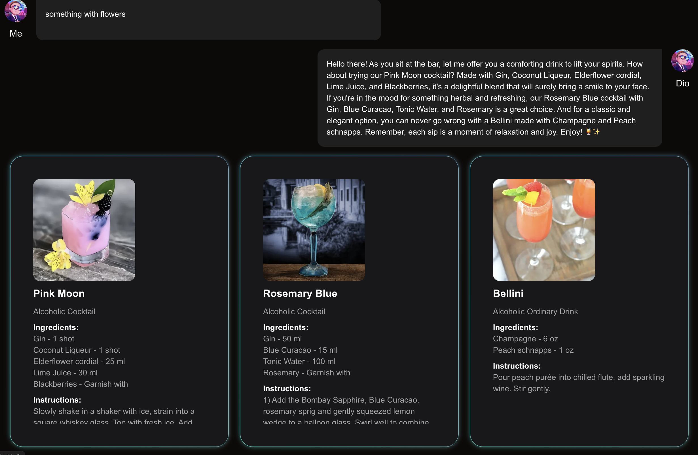

# Weaviate Challenge



## Overview

**Weaviate Challenge** is a cocktail recommendation app powered by Weaviate, OpenAI, and Next.js. Users can interact
with an AI bartender to get personalized cocktail suggestions based on their preferences. The app provides engaging,
dynamic responses and detailed cocktail information, including ingredients, instructions, and images.

## Demo

You can find the live
demo [here](https://www.loom.com/share/608b7079c700427fbd21c47ed39bb3e2?sid=7fb0f61b-c46c-4619-b51b-f4955f515cd4).

## Features

- AI-powered cocktail recommendations using Weaviate and OpenAI.
- Dynamic user interaction with a friendly AI bartender.
- Visual representation of cocktail information.
- Smooth and responsive design built with Next.js and TailwindCSS.

## Stack

- **Frontend**: React, Next.js, TailwindCSS, Radix UI, Framer Motion
- **Backend**: Weaviate client, OpenAI API
- **State Management**: React Hooks
- **Styling**: TailwindCSS, TailwindCSS Animate
- **Other Libraries**: Lucide React, React Icons, React Spinners, Simplex Noise
- **Utilities**: ESLint, Prettier, TypeScript

## How It Works

1. **Prompt Submission**: Users input their preferences or emotions.
2. **Data Processing**: The app queries the Weaviate database to fetch cocktail data.
3. **AI Generation**: The AI bartender generates a personalized response.
4. **Display**: Cocktail details and AI responses are displayed interactively.

## Scripts

- `dev`: Run the development server.
- `build`: Build the application for production.
- `start`: Start the production server.
- `lint`: Run linting with ESLint.

## Installation

1. Clone the repository:
   ```bash
   git clone https://github.com/HugaidaS/AI-workflow
   npm install
   npm run dev
    ```

## Environment Variables

1. Create a .env.local file in the root directory and add the following variables:

    ```bash
    WEAVIATE_URL=your-openai-api-key
    OPENAI_API_KEY=your-weaviate-url
    ADMIN_API_KEY=your-weaviate-api-key
    ```

## Future Enhancements

Enhanced personalization for cocktail recommendations.
Additional datasets and functionality for non-alcoholic options.
Improved visual designs and animations.
Integration with other AI services for more dynamic responses.

## License

This project is licensed under the MIT License - see the [LICENSE](LICENSE) file for details.

